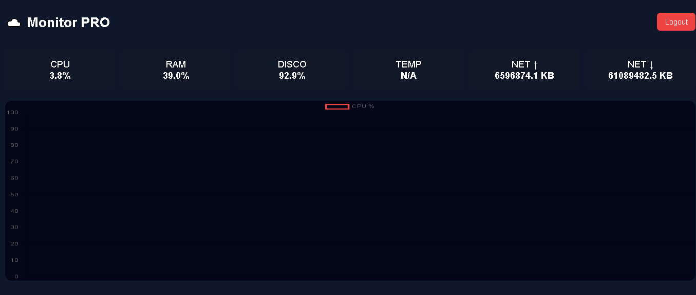

# Monitor — Painel de Monitoramento em Tempo Real

## Sobre o projeto

O MonitorGo é um aplicativo desenvolvido em Go (Golang) para monitoramento de recursos do computador em tempo real através de um painel web moderno.
Inspirado em ferramentas como o Zabbix, o sistema permite acompanhar o desempenho da máquina de forma simples, leve e eficiente diretamente pelo navegador.

## Para que serve

O MonitorGo foi criado para:

🖥️ Monitorar uso de CPU
🌡️ Ver temperatura do processador
💾 Acompanhar uso de disco
🌐 Monitorar tráfego de rede
🚨 Receber alertas de alto uso de CPU
📊 Visualizar gráficos em tempo real
🔐 Proteger acesso com login
🖧 Monitorar múltiplas máquinas

## Credenciais padrão
Usuário: admin
Senha: 1234

# Acessando pela rede

Outras máquinas podem acessar via:

http://IP_DA_MAQUINA:8080

## Ideal para:

Administradores de servidores
Desenvolvedores
Donos de VPS
Monitoramento doméstico
Estudos de infraestrutura

## ✨ Funcionalidades

✅ Dashboard web em tempo real
✅ Gráficos dinâmicos
✅ Monitor de CPU
✅ Monitor de temperatura
✅ Monitor de disco
✅ Monitor de rede
✅ Sistema de alerta (CPU > 80%)
✅ Login protegido
✅ Suporte a múltiplos agentes
✅ Aplicação leve e rápida

## 🛠️ Tecnologias utilizadas

Go (Golang)
HTTP Server nativo
Chart.js
gopsutil

# Contribuição

Pull requests são bem-vindos!
Sinta-se livre para abrir issues e sugerir melhorias.

# Licença

Este projeto é livre para uso educacional e pessoal.

## Autor

Desenvolvido por João Igor Rodrigues Pereira da Silva.